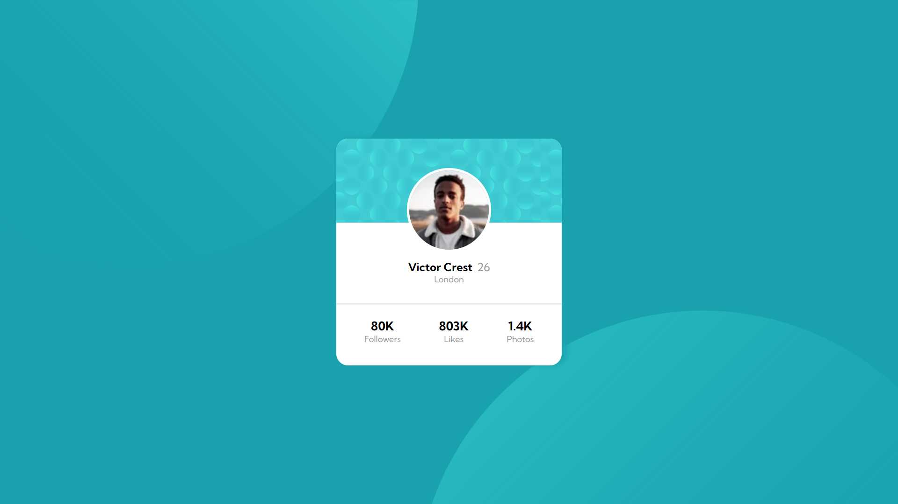
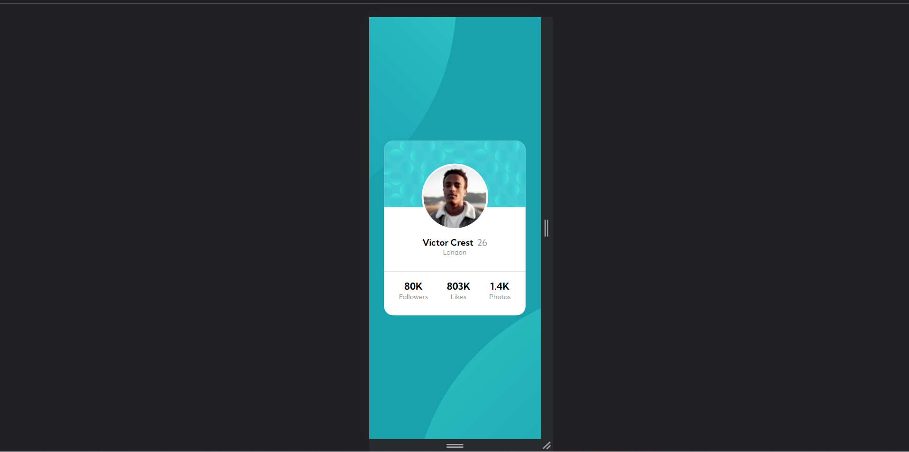

# Profile-Card-Component

# Frontend Mentor - Profile card component solution

This is a solution to the [Profile card component challenge on Frontend Mentor](https://www.frontendmentor.io/challenges/profile-card-component-cfArpWshJ). Frontend Mentor challenges help you improve your coding skills by building realistic projects. 

## Table of contents

- [Overview](#overview)
  - [The challenge](#the-challenge)
  - [Screenshot](#screenshot)
  - [Links](#links)
- [My process](#my-process)
  - [Built with](#built-with)
  - [What I learned](#what-i-learned)
  - [Continued development](#continued-development)
  - [Useful resources](#useful-resources)
- [Author](#author)

## Overview

### The challenge

- Build out the project to the designs provided

### Screenshot




### Links

- Solution URL: [https://amangupta1703.github.io/Profile-Card-Component]
- Live Site URL: [https://github.com/AmanGupta1703/Profile-Card-Component/]

## My process

### Built with

- Semantic HTML5 markup
- CSS custom properties
- Flexbox

### What I learned
1) Pseudo Element

```css
body::before {
  content: url(../images/bg-pattern-top.svg);
  position: absolute;
  top: -525px;
  left: -17%;
  z-index: -1;
}

body {
  background-color: var(--dark-cyan);
  font-family: var(--font-family);
  display: flex;
  align-items: center;
  justify-content: center;
  min-height: 100vh;
  overflow: hidden;
}

body::after {
  content: url(../images/bg-pattern-bottom.svg);
  position: absolute;
  bottom: -650px;
  right: -10%;
  z-index: -1;
}
```
**

### Continued development

1) Pseudo Element
2) Position

### Useful resources

- [W3School -> Pseudo Elements](https://www.w3schools.com/css/css_pseudo_elements.asp)
- [W3School -> Position](https://www.w3schools.com/css/css_positioning.asp)

## Author

- Website - [Profile Card Component](https://github.com/AmanGupta1703/Profile-Card-Component)
- Frontend Mentor - [@AmanGupta1703](https://www.frontendmentor.io/profile/AmanGupta1703)
